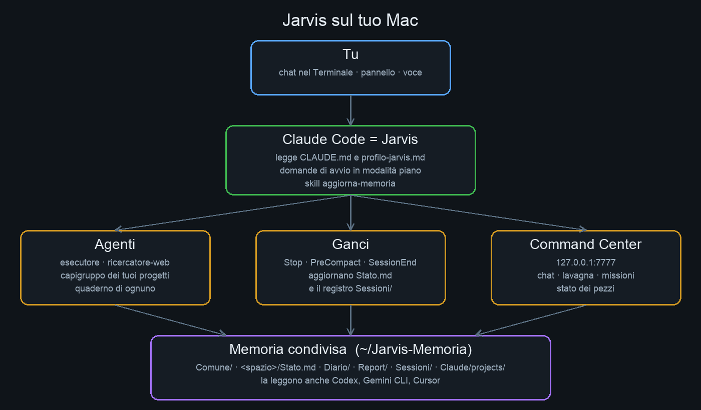

# Jarvis

Un assistente personale costruito su Claude Code, per Mac. Ha un pannello di controllo nel browser (Command Center),
una memoria condivisa fra Claude Code e gli altri programmi di AI che usi, e si adatta a chi lo installa: ti chiede come
vuoi essere chiamato e parte vuoto. Progetti, capigruppo e specialisti nascono dalle tue richieste, uno alla volta.
Gratuito, licenza GPL-3.0.



## Per iniziare

Leggi [INIZIA-QUI.md](INIZIA-QUI.md): dieci righe, dall'installazione di Claude Code alle domande di avvio.
In breve:

```bash
curl -fsSL https://claude.ai/install.sh | bash      # Claude Code (fonte: code.claude.com/docs/en/setup)
git clone https://github.com/AndyTrust/Jarvis ~/Jarvis && cd ~/Jarvis
claude                                              # poi, se non parte da solo: /inizia
```

Claude entra in modalità piano, ti fa le domande una alla volta, ti mostra cosa installerà e dove scriverà, e cambia il Mac
solo dopo il tuo sì. Guida completa: [docs/wiki/Installazione.md](docs/wiki/Installazione.md).

## Progetti e agenti

Dopo l'installazione non c'è nessun progetto. Quando ne nomini uno («apri il progetto Sito», `/nuovo-progetto Sito`),
Jarvis lo crea con `strumenti/crea_progetto.py`: voce in `command-center/spazi.json`, cartella con `File/` per i tuoi
file, `Stato.md` nella memoria e un capogruppo. Il capogruppo crea gli specialisti che servono con
`strumenti/crea_agente.py` (missione, modello, strumenti, limiti, diario). Lavagna e pannello si aggiornano da soli.
Guida: [Progetti e agenti](docs/wiki/Progetti-e-agenti.md).

## Requisiti

- macOS 13 o più nuovo, 4 GB di RAM o più (requisiti di Claude Code).
- Un abbonamento Claude Pro, Max, Team o Enterprise, oppure un account Console: il piano gratuito non include Claude Code.
- Python 3.10 o più nuovo e git (macOS li propone al primo uso; l'installatore può metterli con Homebrew).
- Facoltativi: Homebrew (programmi per voce, mani sul Mac, telefono), un telefono Android, una VPS.

## Cosa copia sul Mac

| Dove | Cosa |
|---|---|
| `~/Jarvis` | questa cartella (codice, guide) e i tuoi file fuori da git: `profilo-jarvis.md`, `command-center/configurazione.json`, `spazi.json` |
| `~/.jarvis/` | risposte di avvio, percorsi, stato dell'installazione e dei ganci, archivio delle chat vecchie |
| `~/Jarvis-Memoria` (o la cartella che scegli) | la memoria condivisa: `Comune/`, `Diario/`, `Report/`, `Sessioni/`, `Claude/projects/`, e una cartella per spazio quando crei un progetto |
| `~/.claude/` | ganci, agenti `esecutore` e `ricercatore-web`, skill `aggiorna-memoria`, `nuovo-progetto` e altre, comandi `/nuovo-progetto` e `/nuovo-agente`; ganci uniti in `settings.json` con copia |
| `~/.codex/AGENTS.md`, `~/.gemini/GEMINI.md` | un blocco che rimanda alla memoria, solo se usi quei programmi |
| `~/.locale-onedrive/jarvis-widget-venv`, `~/Jarvis/backtalk/.venv` | ambienti Python dell'orb e delle missioni |
| Homebrew | solo i programmi dei gruppi che servono (vedi `Brewfile`) |
| `~/Progetti/<nome>` (o la cartella che indichi) | un progetto, solo quando lo crei |
| `~/Library/LaunchAgents/com.jarvis.*` | lavori automatici, solo se li chiedi |

Ogni file che esiste già viene copiato in `<file>.bak-AAAAMMGG` prima di cambiarlo. Niente viene cancellato.

## Aggiornare

```bash
cd ~/Jarvis && git pull --ff-only && claude     # poi /aggiorna
```

Dettagli: [Aggiornare Jarvis](docs/wiki/Aggiornare-Jarvis.md).

## Disinstallare

Passo per passo in [Disinstallare](docs/wiki/Disinstallare.md): lavori automatici, collegamenti della memoria, ganci,
agenti, ambienti, cartella. La memoria resta tua finché non la cancelli.

## Privacy

- Il pannello ascolta solo su `127.0.0.1`: da fuori dal Mac non si vede.
- Le chiavi stanno in `~/.env.jarvis` (`chmod 600`), fuori da ogni repository e fuori dalla memoria. Le domande di avvio non le chiedono.
- La memoria sta dove scegli tu. Se scegli iCloud Drive o OneDrive, viaggia con quel servizio.
- Le conversazioni passano da Claude Code e quindi da Anthropic, secondo i termini del tuo abbonamento.
- Nessuna telemetria di Jarvis.
- Le password dei siti, le carte e i PIN possono stare nel **Vault** del pannello: parte vuoto, è cifrato sul Mac
  (chiave nel Portachiavi di macOS), si apre con email e password e si recupera con 24 parole. Guida:
  [docs/wiki/Vault.md](docs/wiki/Vault.md).

## VPS (facoltativa)

Jarvis funziona tutto sul Mac. Se vuoi alcune cose accese anche a Mac spento, puoi usare una VPS: guida in
[docs/wiki/VPS.md](docs/wiki/VPS.md). Il link al provider in quella pagina è un **link di affiliazione** dell'autore
(https://www.hostinger.com/it/prezzi?REFERRALCODE=ITALOMARZIANO): se compri da lì l'autore può ricevere una commissione, il prezzo per te non cambia.

## Guida

[docs/wiki/Home.md](docs/wiki/Home.md): Installazione, Come funziona, Memoria condivisa, Agenti, Voce, Telefono, VPS,
Vault, Aggiornare, Disinstallare, Problemi.

## Licenza

GNU General Public License v3.0, vedi [LICENSE](LICENSE). Puoi usare, studiare, modificare e ridistribuire Jarvis.
Chi lo modifica e lo ridistribuisce deve farlo con la stessa licenza GPL-3.0 e dare il codice sorgente a chi riceve il programma.
La GPL non vieta di vendere: chi vende una copia deve rispettare le stesse condizioni.
Il codice di altri autori incluso o installato ha la sua licenza: vedi [NOTICE.md](NOTICE.md).
